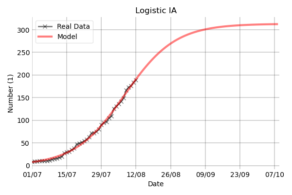

# Fit Data COVID-19 (Spain)

Fit the official data for Spain (https://github.com/montera34/escovid19data) to logistic or exponential models, and also use Prophet (https://facebook.github.io/prophet/) to predict the evolution of the data using Time Series.

Manual data can be provided in order to clean some messy official data. For instance, one can add the accumulated incidence (IA) manually:

This same Time Series can be predicted using Prophet:
 

## Usage example

Edit `tests.py` to use the desired parameters, and then run `python tests.py`. 
All plots will be created in `~\figures`.
