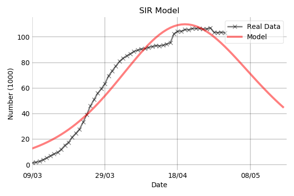
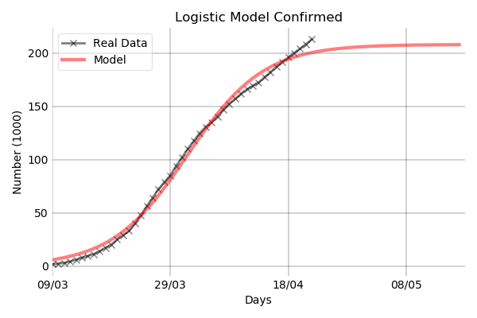
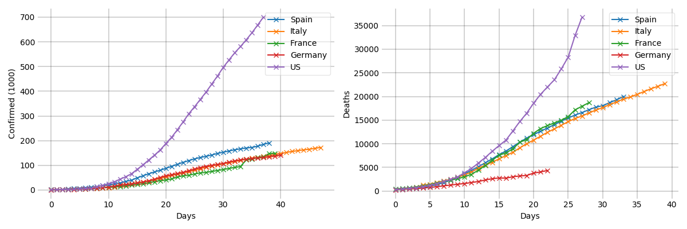

# Fit Data COVID-19

Fit updated data for COVID-19 (https://github.com/datasets/covid-19) to different models, or compare cases between countries.

## Usage example

Edit `tests.py` to use the desired parameters, and then run `python tests.py`. All plots will be created in `~\figures`.
