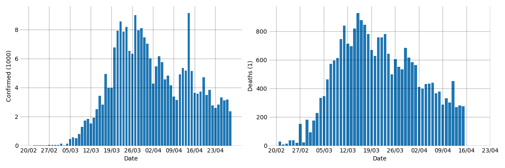
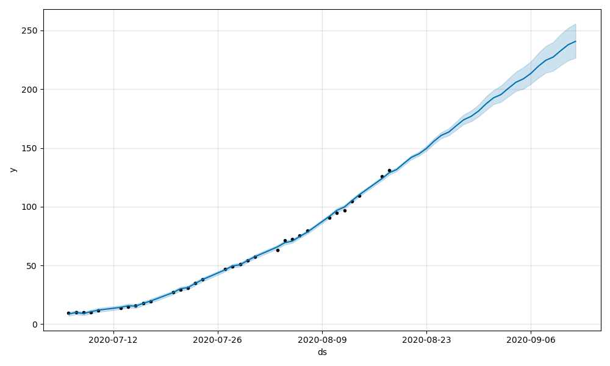

# Fit Data COVID-19

Fit updated data for COVID-19 (https://github.com/datasets/covid-19) to different models, 
or compare cases between countries.

In this particular case, for Spain, the SIR Model gives the following figure:

Fitting the logistic model to new dates we get the following:

Daily new cases and deaths for Spain:

Different confirmed cases for all the counties in Spain:

Simple prediction using Facebook Prophet's Time Series:
 

## Usage example

Edit `tests.py` to use the desired parameters, and then run `python tests.py`. 
All plots will be created in `~\figures`.
